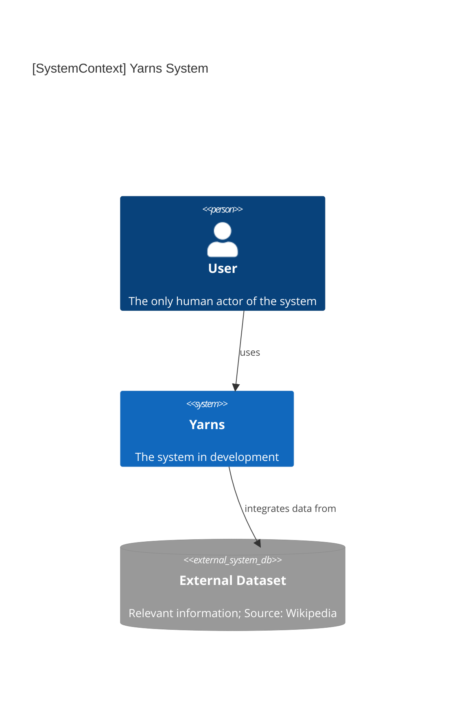
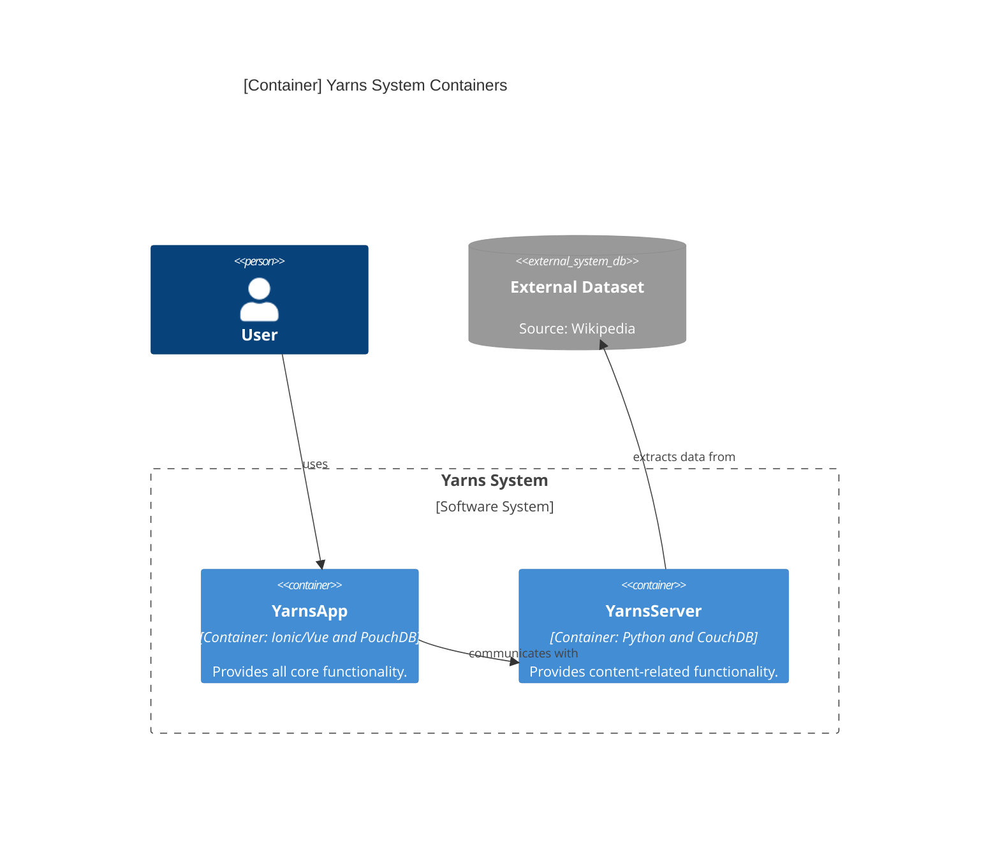
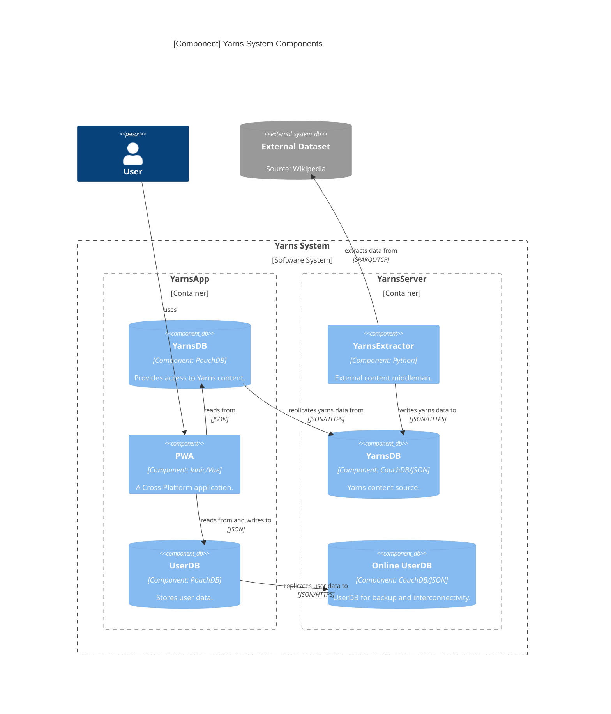
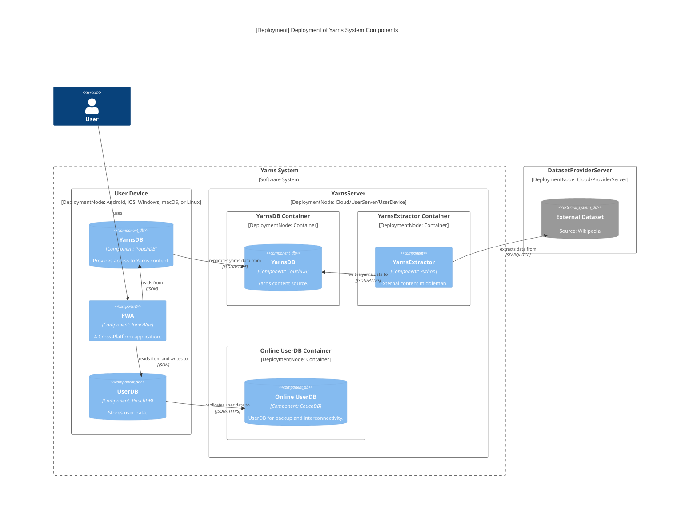

# System Overview

- [Back to README](../../../README.md)
- [Back to documentation index](../../index.md)

---

This page documents the *Yarns* system so that developers have a general idea of how the system should work.

The [C4](https://c4model.com/) model is used to visualize the higher levels of the architecture.
The system is presented from a high-level perspective, starting with the system's context (level 1) and progressing down to the component level (level 3).
Code diagrams (level 4) are not included in this documentation since they can be difficult to maintain.

## Level 1 - System Context

- The *User*, as expected, is the one using the Yarns application for his own personal use.
- *Yarns* is a web-application that provides all kinds of functionalities related to [yarns](../../../README.md#defining-yarn): view information, rate, create lists, etc.
- The *External Dataset* is the main information source of *Yarns*.
It's a vital element because *Yarns* cannot exist without yarns-related information being present in the system.
With that in mind, a proper information source had to be chosen and Wikipedia was selected (please refer to [Information Source of YarnsDB](./yarnsdb.md#information-source) for the reasoning on this).

## Level 2 - Containers

- The [*YarnsApp*](./application.md) is a [Progressive Web App (PWA)](https://en.wikipedia.org/wiki/Progressive_web_app) built with the Ionic/Vue framework, along with PouchDB as the client-side database (please refer to [Technologies of YarnsApp](./application.md#technologies) for the reasoning on this).
- The [*YarnsServer*](./server.md) is a server (or a group of servers) that provides information to the frontend application.
It's built with Python to extract the desired content and CouchDB as the database engine (please refer to [Technologies of YarnsServer](./server.md#technologies) for the reasoning on this).

## Level 3 - Components

- *YarnsServer* contains the following components:
  - [*YarnsDB*](./yarnsdb.md): a CouchDB instance that contains the main content of the application, i.e., information regarding all yarns (please refer to [YarnsDB of YarnsServer](./server.md#yarnsdb) for more information);
    - Instead of a CouchDB instance, *YarnsDB* could be represented as JSON files;
  - Online [*UserDB*](./userdb.md): a CouchDB instance that contains personal and private information regarding each user and is a replication of the local database (please refer to [Online UserDB of YarnsServer](./server.md#online-userdb) for more information);
    - Instead of a CouchDB instance, the *Online UserDB* could be represented JSON files.
      However, in this case, the user would only be able to use the functionalities that do not require interaction with other users;
  - [*YarnsExtractor*](./extractor.md): the component responsible for extracting, transforming, and loading content into *YarnsDB* (please refer to [YarnsExtractor of YarnsServer](./server.md#yarnsextractor) for more information);
- *YarnsApp* contains the following components:
  - [*PWA*](./application.md): the frontend application;
  - [*YarnsDB*](./yarnsdb.md): a local replication of the remote *YarnsDB*;
  - [*UserDB*](./userdb.md): a PouchDB instance where user-specific data is stored and, optionally, replicated into an *Online UserDB*

### Deployment

- YarnsApp is installed on the user's device and can be used natively by building the PWA into a standalone app.
  It can also be deployed to the cloud and accessed through a web browser.
- YarnsServer is a modular, multi-instance system that allows for flexible deployment options, such as cloud, server, or local device.
  Multiple databases can be set up to provide different types of content and to replicate or backup data.
  YarnsOrg, users, or other organizations can manage these instances, and users can select their preferred one.
