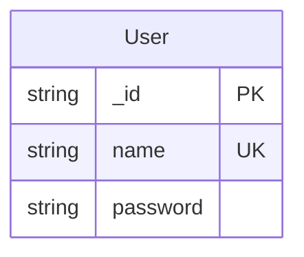
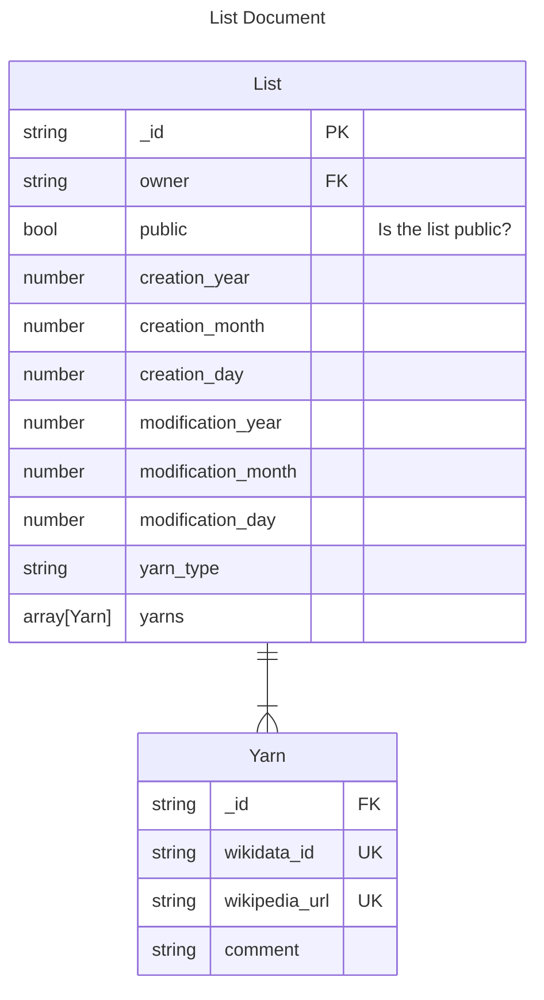
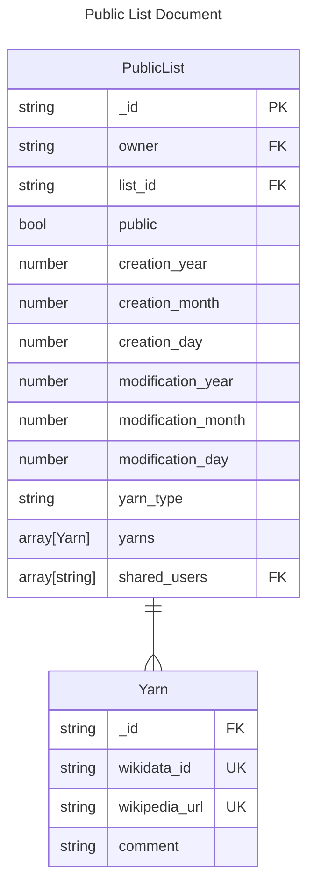
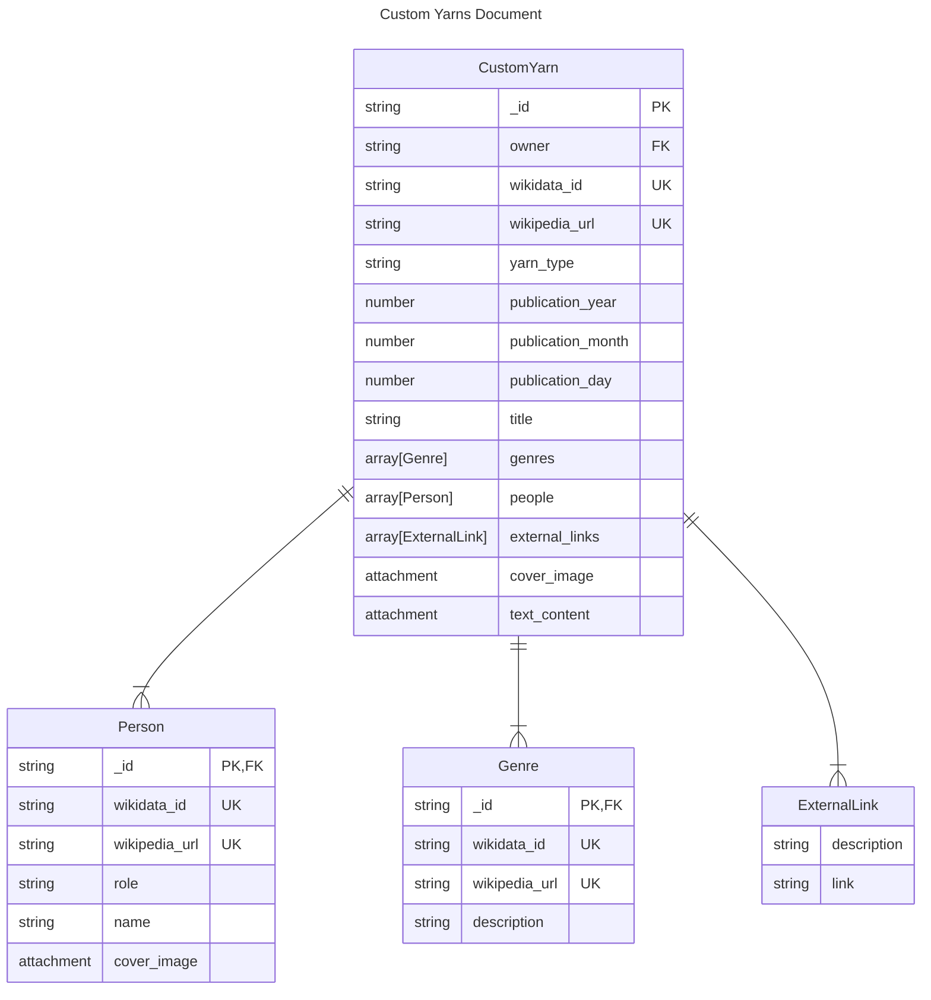
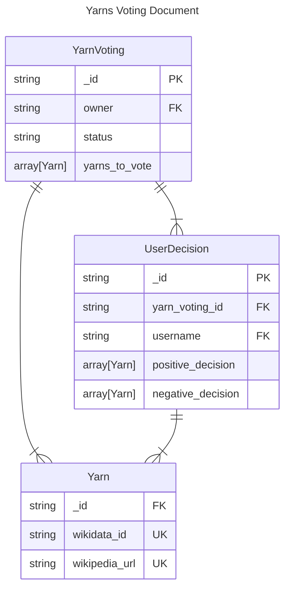
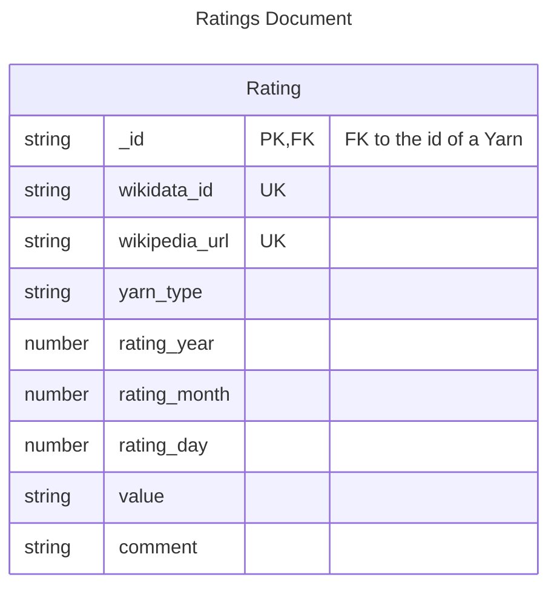

# UserDB Schema

- [Back to README](../../../README.md)
- [Back to documentation index](../../index.md)

---

This page documents UserDB: a document-oriented database, responsible for storing user-related information.
If you have not yet reviewed the system documentation, please take a look [here](./system.md).

## Table of Contents

- [UserDB Schema](#userdb-schema)
  - [Table of Contents](#table-of-contents)
  - [Description](#description)
  - [Database Diagrams](#database-diagrams)
    - [Users Database](#users-database)
    - [Lists Database](#lists-database)
    - [Public Lists Database](#public-lists-database)
    - [Custom Yarns Database](#custom-yarns-database)
    - [Yarns Voting and User Decision Databases](#yarns-voting-and-user-decision-databases)
    - [Ratings Database](#ratings-database)

## Description

The UserDB contains personal and private information of each user.
It's both a remote and local database, used for offline-first access.
The backend of the remote database is CouchDB, while the local one is PouchDB.
The idea for YarnsApp surfaced when looking for an alternative to the mainstream, privacy-invading apps.
With that in mind, all private information is end-to-end encrypted, with the exception of the owner of each document, and the database used for public lists.
To achieve this, the [Crypto-Pouch](https://github.com/calvinmetcalf/crypto-pouch) is used to encrypt the information.

## Database Diagrams

This section uses Database Diagrams to illustrate the various databases in the CouchDB server of Yarns.

Things to keep in mind:

- The diagrams reflect *document-oriented* NoSQL databases
- In CouchDB, a database is a collection of documents

### Users Database

The `_users` database is a special authentication database provided by CouchDB that stores the users registered in the database.



### Lists Database

The `lists` database contains all user-created, personal lists.



A JSON example of this diagram is provided bellow:

```json
{
  "_id": "a006879afdcae324d70e925c420c860d",
  "owner": "foo",
  "public": false,
  "creation_year": 2023,
  "creation_month": 12,
  "creation_day": 1,
  "modification_year": 2023,
  "modification_month": 12,
  "modification_day": 5,
  "yarn_type": "film",
  "yarns": [
    {
      "_id": "97bbdb4a1c7166682dc026e1ac97a64c",
      "wikidata_id": "Q47703",
      "wikipedia_url": "https://en.wikipedia.org/wiki/The_godfather",
      "comment": "Magnificent storytelling"
    },
    {
      "_id": "35fdd1c8346c22ccc43cc45cd632e6d6",
      "wikidata_id": "Q189540",
      "wikipedia_url": "https://en.wikipedia.org/wiki/Seven_samurai",
      "comment": "Cinematic masterpiece"
    }
  ]
}
```

### Public Lists Database

The `public_lists` database contains all the user lists that have been made public by the user itself.
They are quite simply a decrypted copy of the original `list` of the user.
The only difference is that a field for `shared_users` has been added in order to be able to share the list only with specific users.



### Custom Yarns Database

The `custom_yarns` database contains all Yarns created by the user that are not present in the YarnsDB.



The structure of the JSON document is the same as [Yarns Database](yarnsdb.md#yarns-database).

### Yarns Voting and User Decision Databases

The `yarns_voting` database contains the information to start the polling functionality to consume a yarn collectively.
The `user_decisions` database aggregates the information of each user.



A JSON example of this diagram is provided bellow.

YarnVoting:

```json
{
  "_id": "5f7716ee487cc4083545d4ca02cd45d4",
  "owner": "foo",
  "status": "completed",
  "yarns_to_vote": [
    {
      "_id": "97bbdb4a1c7166682dc026e1ac97a64c",
      "wikidata_id": "Q47703",
      "wikipedia_url": "https://en.wikipedia.org/wiki/The_godfather"
    },
    {
      "_id": "35fdd1c8346c22ccc43cc45cd632e6d6",
      "wikidata_id": "Q189540",
      "wikipedia_url": "https://en.wikipedia.org/wiki/Seven_samurai"
    },
    {
      "_id": "3840b51b0b81b46cab99384d5cd106e3",
      "wikidata_id": "Q533383",
      "wikipedia_url": "https://en.wikipedia.org/wiki/The_Room"
    }
  ]
}
```

UserDecision:

```json
{
  "_id": "eb242b506a6ae330bda6969bb2677079",
  "yarn_voting_id": "5f7716ee487cc4083545d4ca02cd45d4",
  "username": "foo",
  "positive_decision": [
    {
      "_id": "97bbdb4a1c7166682dc026e1ac97a64c",
      "wikidata_id": "Q47703",
      "wikipedia_url": "https://en.wikipedia.org/wiki/The_godfather"
    },
    {
      "_id": "35fdd1c8346c22ccc43cc45cd632e6d6",
      "wikidata_id": "Q189540",
      "wikipedia_url": "https://en.wikipedia.org/wiki/Seven_samurai"
    }
  ],
  "negative_decision": [
    {
      "_id": "3840b51b0b81b46cab99384d5cd106e3",
      "wikidata_id": "Q533383",
      "wikipedia_url": "https://en.wikipedia.org/wiki/The_Room"
    }
  ]
}
```

### Ratings Database

The `ratings` database stores all user ratings for all YarnTypes.



A JSON example of this diagram is provided bellow:

```json
{
  "_id": "97bbdb4a1c7166682dc026e1ac97a64c",
  "wikidata_id": "Q47703",
  "wikipedia_url": "https://en.wikipedia.org/wiki/The_godfather",
  "yarn_type": "film",
  "rating_year": 2019,
  "rating_month": 8,
  "rating_day": 25,
  "value": 10,
  "comment": "This is one of the finest examples of storytelling that exists today. It has remarkable scenes and enduring moments.",
}
```
