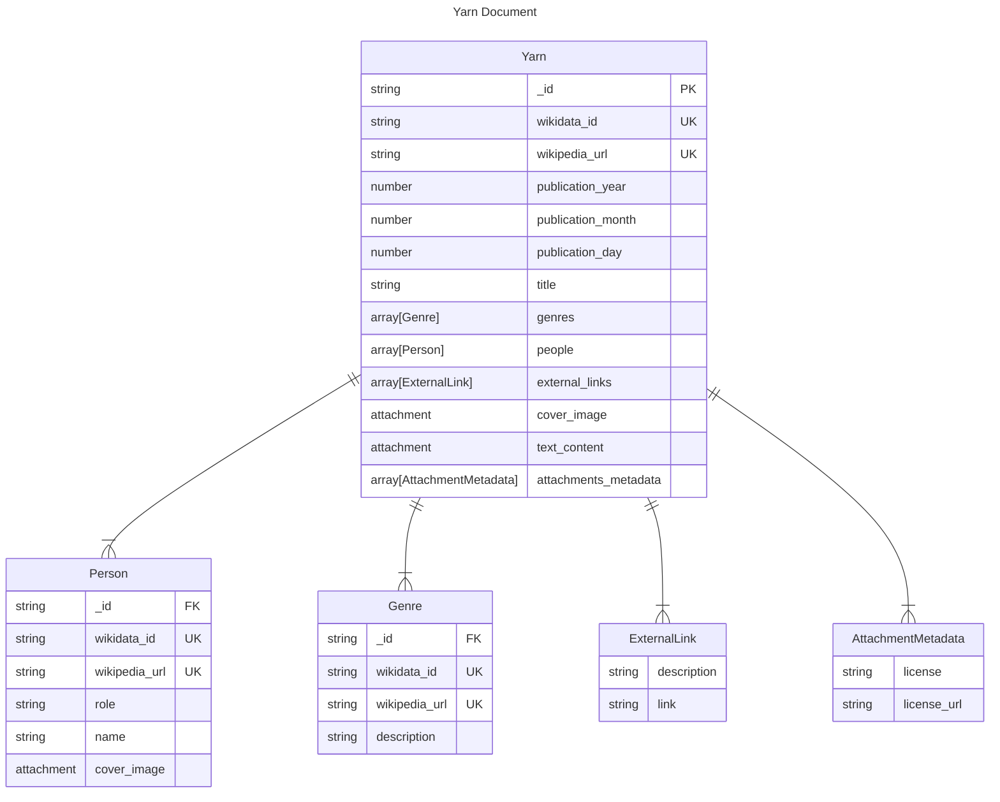
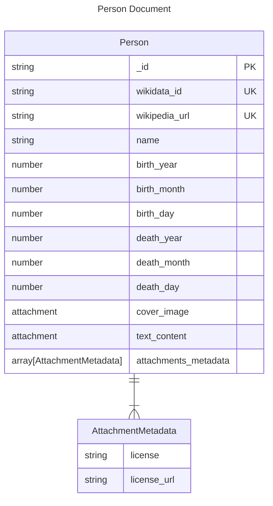
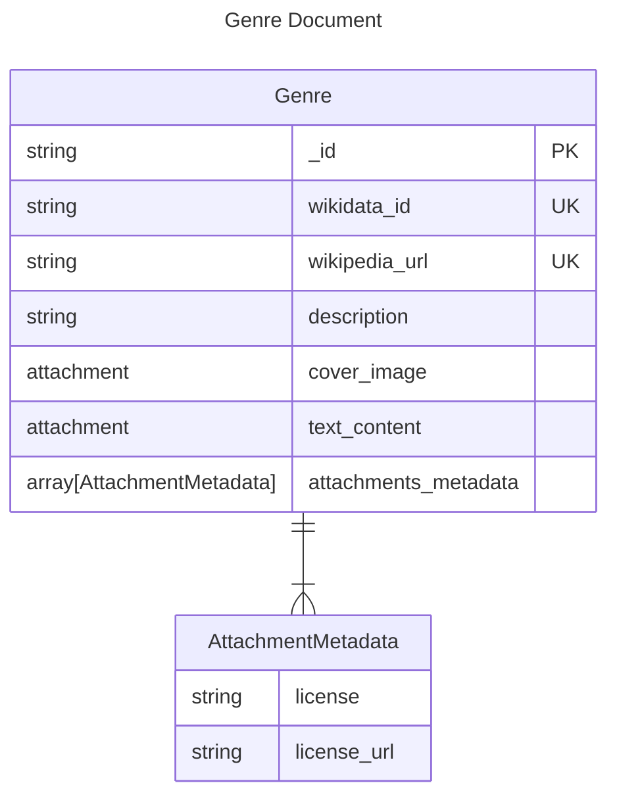

# YarnsDB Content and Schema

- [Back to README](../../../README.md)
- [Back to documentation index](../../index.md)

---

This page documents YarnsDB: a document-oriented database, responsible for aggregating information regarding Yarns.
If you have not yet reviewed the system documentation, please take a look [here](./system.md).

## Table of Contents

- [YarnsDB Content and Schema](#yarnsdb-content-and-schema)
  - [Table of Contents](#table-of-contents)
  - [Description](#description)
  - [Information Source](#information-source)
  - [Database Diagrams](#database-diagrams)
    - [Yarns Database](#yarns-database)
    - [People Database](#people-database)
    - [Genres Database](#genres-database)

## Description

YarnsDB contains only information provided by a third-party (i.e., Wikipedia), which allows the PWA to show all relevant information.
This database *must* prevent all write operations, allowing only for YarnsExtractor and administrators to do this kind of operations.

## Information Source

The external information is of the most vital importance in Yarns, because the application cannot function without yarns-related information in the system.
Therefore, a decision of which information source to choose had to be done.
Available options included [IMDb](https://www.imdb.com/), [TMDB](https://www.themoviedb.org/), [Google Books](https://books.google.com/), [Open Library](https://openlibrary.org/), [Wikipedia](https://www.wikipedia.org/), and other.
Most of these, with the exception of Wikipedia exhibit at least one of the following disadvantages:

- Restrictive copyright/license
- Restrictive API, preventing offline-first implementation
- Limited yarn types (please refer to [Possible Yarn Types](./extractor.md#possible-yarn-types) for more information on yarn types)

Using a service that exhibits at least one of these disadvantages could harm the future of Yarns and greatly increase its complexity.
Wikipedia, on the other hand, shows none of these disadvantages:

- It uses [copyleft](https://en.wikipedia.org/wiki/Copyleft) licenses[^wikipedia_license] (i.e., [CC BY-SA](https://en.wikipedia.org/wiki/Wikipedia:Text_of_Creative_Commons_Attribution-ShareAlike_3.0_Unported_License), [GFDL](https://en.wikipedia.org/wiki/Wikipedia:Text_of_the_GNU_Free_Documentation_License)), which means that they can be redistributed as long as some restrictions are met
- Provides services from which all information can be extracted (i.e., [Wikidata Query Service](https://www.wikidata.org/wiki/Wikidata:SPARQL_query_service/Wikidata_Query_Help), [MediaWiki REST API](https://www.mediawiki.org/wiki/Special:MyLanguage/API:REST_API), [MediaWiki Action API](https://www.mediawiki.org/wiki/Special:MyLanguage/API:Main_page))
- Has information for all relevant [yarn types](./extractor.md#possible-yarn-types)

This is why Wikipedia has been chosen as the data source for Yarns.

## Database Diagrams

This section uses Database Diagrams to illustrate the various databases in the CouchDB server of Yarns.

Things to keep in mind:

- The diagrams reflect *document-oriented* NoSQL databases
- In CouchDB, a database is a collection of documents

### Yarns Database

The `yarns` database contains direct information about the yarns themselves.
Each yarn type has its own db in CouchDB.
With that in mind, the yarn database/document representation in the following diagram is an abstraction of film_yarn, tvseries_yarn, book_yarn, etc.



Person, Genre, and ExternalLink are all JSON objects contained within a Yarn.

A JSON example of this diagram is provided bellow:

```json
{
  "_id": "97bbdb4a1c7166682dc026e1ac97a64c",
  "wikidata_id": "Q47703",
  "wikipedia_url": "https://en.wikipedia.org/wiki/The_godfather",
  "publication_year": 1972,
  "publication_month": 3,
  "publication_day": 15,
  "title": "The Godfather",
  "genres": [
    {
      "_id": "eb242b506a6ae330bda6969bb2677079",
      "wikidata_id": "Q130232",
      "wikipedia_url": "https://en.wikipedia.org/wiki/Drama_(film_and_television)",
      "description": "drama film"
    },
    {
      "_id": "5fcbbf2cb171b1d5c3bc6df3d4affb32",
      "wikidata_id": "Q959790",
      "wikipedia_url": "https://en.wikipedia.org/wiki/Crime_film",
      "description": "crime film"
    },
    {
      "_id": "9115e0942372a87a977f1caf30b2ac29",
      "wikidata_id": "Q7444356",
      "wikipedia_url": "https://en.wikipedia.org/wiki/Gangster_film",
      "description": "gangster film"
    }
  ],
  "people": [
    {
      "_id": "b848dbdeb422164babf2705ac18173e1",
      "wikidata_id": "Q56094",
      "wikipedia_url": "https://en.wikipedia.org/wiki/Francis_Ford_Coppola",
      "role": "director",
      "name": "Francis Ford Coppola"
    },
    {
      "_id": "b7a8566af7e0fc02404bb676b47c3bf7",
      "wikidata_id": "Q34012",
      "wikipedia_url": "https://en.wikipedia.org/wiki/Marlon_Brando",
      "role": "cast_member",
      "name": "Marlon Brando"
    },
    {
      "_id": "a006879afdcae324d70e925c420c860d",
      "wikidata_id": "Q41163",
      "wikipedia_url": "https://en.wikipedia.org/wiki/Al_Pacino",
      "role": "cast_member",
      "name": "Al Pacino"
    }
  ],
  "external_links": [
    {
      "description": "IMDb",
      "link": "https://www.imdb.com/title/tt0068646/"
    },
    {
      "description": "Rotten Tomatoes",
      "link": "https://www.rottentomatoes.com/m/the_godfather"
    }
  ],
  "attachments_metadata": {
    "cover_image": {
      "license": "Creative Commons Attribution-Share Alike 4.0",
      "license_url": "https://creativecommons.org/licenses/by-sa/4.0/deed.en"
    },
    "text_content": {
      "license": "Creative Commons Attribution-Share Alike 4.0",
      "license_url": "https://creativecommons.org/licenses/by-sa/4.0/deed.en"
    },
    "Q56094_cover_image": {
      "license": "Creative Commons Attribution-Share Alike 4.0",
      "license_url": "https://creativecommons.org/licenses/by-sa/4.0/deed.en"
    },
    "Q34012_cover_image": {
      "license": "Creative Commons Attribution-Share Alike 4.0",
      "license_url": "https://creativecommons.org/licenses/by-sa/4.0/deed.en"
    },
    "Q41163_cover_image": {
      "license": "Creative Commons Attribution-Share Alike 4.0",
      "license_url": "https://creativecommons.org/licenses/by-sa/4.0/deed.en"
    }
  },
  "_attachments": {
    "cover_image": {
      "content_type": "image/jpeg",
      "digest": "<MD5_DIGEST_STUB>",
      "length": 99999,
      "revpos": 1,
      "stub": true
    },
    "text_content": {
      "content_type": "text/plain",
      "digest": "<MD5_DIGEST_STUB>",
      "length": 99999,
      "revpos": 1,
      "stub": true
    },
    "Q56094_cover_image": {
      "content_type": "image/jpeg",
      "digest": "<MD5_DIGEST_STUB>",
      "length": 99999,
      "revpos": 1,
      "stub": true
    },
    "Q34012_cover_image": {
      "content_type": "image/jpeg",
      "digest": "<MD5_DIGEST_STUB>",
      "length": 99999,
      "revpos": 1,
      "stub": true
    },
    "Q41163_cover_image": {
      "content_type": "image/jpeg",
      "digest": "<MD5_DIGEST_STUB>",
      "length": 99999,
      "revpos": 1,
      "stub": true
    }
  }
}
```

### People Database

The `people` database contains information about people associated with the yarn database.
There is a person database for each yarn type.
With that in mind, the person database/document representation in the following diagram is an abstraction of film_person, tvseries_person, book_person, etc.



A JSON example of this diagram is provided bellow:

```json
{
  "_id": "3840b51b0b81b46cab99384d5cd106e3",
  "wikidata_id": "Q39792",
  "wikipedia_url": "https://en.wikipedia.org/wiki/Jack_nicholson",
  "name": "Jack Nicholson",
  "birth_year": 1937,
  "birth_month": 4,
  "birth_day": 22,
  "death_year": null,
  "death_month": null,
  "death_day": null,
  "attachments_metadata": {
    "cover_image": {
      "license": "Creative Commons Attribution-Share Alike 4.0",
      "license_url": "https://creativecommons.org/licenses/by-sa/4.0/deed.en"
    },
    "text_content": {
      "license": "Creative Commons Attribution-Share Alike 4.0",
      "license_url": "https://creativecommons.org/licenses/by-sa/4.0/deed.en"
    }
  },
  "_attachments": {
    "cover_image": {
      "content_type": "image/jpeg",
      "digest": "<MD5_DIGEST_STUB>",
      "length": 99999,
      "revpos": 1,
      "stub": true
    },
    "text_content": {
      "content_type": "text/plain",
      "digest": "<MD5_DIGEST_STUB>",
      "length": 99999,
      "revpos": 1,
      "stub": true
    }
  }
}
```

### Genres Database

The `genres` database contains information regarding genres associated with the yarn database.
There is a genre database for each yarn type.
With that in mind, the genre database/document representation in the following diagram is an abstraction of film_genre, tvseries_genre, book_genre, etc.



A JSON example of this diagram is provided bellow:

```json
{
  "_id": "eb242b506a6ae330bda6969bb2677079",
  "wikidata_id": "Q130232",
  "wikipedia_url": "https://en.wikipedia.org/wiki/Drama_(film_and_television)",
  "description": "drama film",
  "attachments_metadata": {
    "cover_image": {
      "license": "Creative Commons Attribution-Share Alike 4.0",
      "license_url": "https://creativecommons.org/licenses/by-sa/4.0/deed.en"
    },
    "text_content": {
      "license": "Creative Commons Attribution-Share Alike 4.0",
      "license_url": "https://creativecommons.org/licenses/by-sa/4.0/deed.en"
    }
  },
  "_attachments": {
    "cover_image": {
      "content_type": "image/jpeg",
      "digest": "<MD5_DIGEST_STUB>",
      "length": 99999,
      "revpos": 1,
      "stub": true
    },
    "text_content": {
      "content_type": "text/plain",
      "digest": "<MD5_DIGEST_STUB>",
      "length": 99999,
      "revpos": 1,
      "stub": true
    }
  }
}
```

[^wikipedia_license]: <https://en.wikipedia.org/wiki/Wikipedia:Copyrights> (last visited on 2023-10-06)
